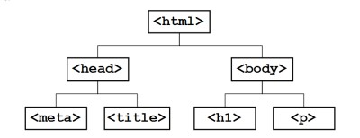

# HTML Tree / Document Object Model (DOM)

Apabila diperhatikan, tag yang ada pada sebuah file HTML memiliki struktur tersendiri. Struktur ini biasa disebut sebagai Document Object Model (DOM).

Sesuai dengan istilah tersebut, kode HTML dapat diibaratkan seperti pohon, diman setiap tag saling terhubung satu sama lain.

# Mengapa hal ini perlu diperhatikan?

Mempelajari mengenai DOM HTML akan membuat perancang website semakin yakin untuk merancang dan menerapkan strukturnya dengan rapi dan mudah di kembangkan. Selain itu, dengan menggunakan DOM HTML ini akan memudahkan jika sudah digabung dengan CSS dan Javascript.

berikut gambaran sederhana dari DOM HTML

