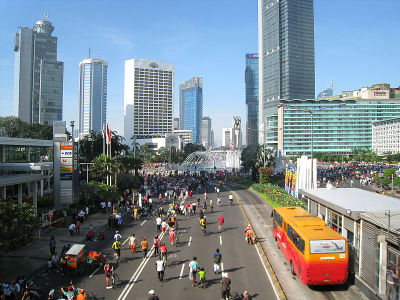

# Usemap

Atribut `usemap` digunakan untuk membuat pemetaan bagian gambar untuk dijadikan sebagai link.

Pernah melihat sebuah website yang memiliki gambar besar dengan berbagai aspek? setiap aspek memiliki link tersendiri. Untuk membuat hal seperti itu cukup mudah karena terdapat atribut `usemap`.

Agar fungsi dari atribut ini dapat bekerja dengan baik maka diperlukan 2 tag yaitu `<map>` dan tag `<area>`. Kedua tag ini berfungsi untuk mendefinisikan letak gambar mana yang akan dijadikan link.

berikut contoh penerpaan-nya

```html

<map name="map">
    <area shape="rect" coords="250,175,400,300" href="http://id.wikipedia.org/wiki/Transjakarta" alt="Bus Transjakarta" title="Bus Transjakarta">
    <area shape="rect" coords="275,100,400,160" href="http://id.wikipedia.org/wiki/Hotel_Indonesia" alt="Hotel Indonesia" title="Hotel Indonesia">
    <area shape="circle" coords="200,150,50" href="https://id.wikipedia.org/wiki/Monumen_Selamat_Datang" alt="Monumen" title="Monumen">
</map>
```