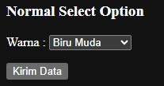
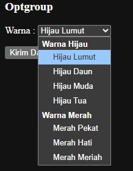

# Form Select and Option

Pernah melihat meme dimana sebuah form terdapat select option untuk memilih satu-satu nomer HP? wkwkwkwk kalau pernah. maka selamat anda penikmat meme programmer. Selain menggunakan teknik `checkbox`. Sebuah form juga dapat menggunakan tag `<select>` dan `<option>` untuk memberikan pilihan data kepada user.

tag `<select>` ditambah atribut `name` dan tag `<option>` ditambah atribut `value`. Maka hal tersebut dapat diterima oleh form sebagai data dan dapat dikirim ke server.

berikut contoh penulisan select dan option saja.

```html
<p>Warna : 
    <select name="warna_baju">
        <option value="merah">Merah Jambu</option>
        <option value="hijau">Ijo Lumut</option>
        <option value="hitam">Hitam Pekat</option>
        <option value="biru">Biru Muda</option>
        <option value="cokelat">Cokelat Tua</option>
    </select>
</p>
```

Untuk penulisan lengkap-nya dengan form, lihat kode dibawah ini

```html
<form action="proses.php" method="get">
    <p>Warna : 
        <select name="warna_baju">
            <option value="merah">Merah Jambu</option>
            <option value="hijau">Ijo Lumut</option>
            <option value="hitam">Hitam Pekat</option>
            <option value="biru">Biru Muda</option>
            <option value="cokelat">Cokelat Tua</option>
        </select>
    </p>
    <p><input type="submit" value="Kirim Data"></p>
</form
```

Perlu diperhatikan, ini hanyalah contoh. Kita gunakan method `get` untuk mendapatkan nilai dari option-nya. Ketika kita klik kirim, maka nanti akan mendapatkan hasilnya pada bilah <b>URL</b>. Langsung saja coba kode diatas.

berikut contoh gambar-nya, kita coba pilih biru muda dan klik "<b>Kirim Data</b>".



Maka hasilnya akan menampilkan `biru muda = biru`. Hal ini merujuk pada atribut `value` yang berada pada tag `<option>`. Abaikan proses.php karena itu hanya sebagai pancingan saja.


## Selected

Ada atribut untuk tag `<option>` yang biasanya digunakan yaitu selected. Fungsi-nya sama seperti yang ada di `checkbox` yaitu langsung ditentukan ketika halaman dimuat. Jika `checkbox` ada `checked` maka `<option>` ada `selected`.

berikut contoh penulisan lengkap-nya

```html
<form action="proses.php" method="get">
    <p>Warna : 
        <select name="warna_baju">
            <option value="merah">Merah Jambu</option>
            <option value="hijau">Ijo Lumut</option>
            <option value="hitam">Hitam Pekat</option>
            <option value="biru" selected>Biru Muda</option>
            <option value="cokelat">Cokelat Tua</option>
        </select>
    </p>
    <p><input type="submit" value="Kirim Data"></p>
</form>
```

Ketika dijalankan, maka pilihan pertama setelah halaman dimuat adalah "<b>Biru Muda</b>". Karena opsi tersebut memiliki atribut `selected`. Apabila tidak ada atribut tersebut maka pilihan ketika halaman dimuat adalah "<b>Merah Jambu</b>"


# Form Optgroup

Tag ini adalah tag untuk mempercantik tampilan dari sebuah select option, dimana ketika terdapat banyak pilihan dan kita perlu mengelompokkan pilihan tersebut sesuai label-nya masing-masing maka bisa gunakan tag `<optgroup>. Contoh case-nya seperti tadi, terdapat beberapa warna yang dapat dipilih.

Apabila terdapat beberapa pilihan warna seperti : merah, biru, dan hijau. Maka dapat dikelompokkan sesuai warna-nya. Berikut contoh penulisan lengkap dengan form-nya.

```html
<form action="proses.php" method="get">
    <p>Warna : 
        <select name="warna_baju">
            <optgroup label="Warna Hijau">
                <option value="hijau_lumut">Hijau Lumut</option>
                <option value="hijau_daun">Hijau Daun</option>
                <option value="hijau_muda">Hijau Muda</option>
                <option value="hijau_tua">Hijau Tua</option>
            </optgroup>
            <optgroup label="Warna Merah">
                <option value="merah_pekat">Merah Pekat</option>
                <option value="merah_hati">Merah Hati</option>
                <option value="merah_meriah">Merah Meriah</option>
            </optgroup>
        </select>
    </p>
    <p><input type="submit" value="Kirim Data"></p>
</form>
```

Terlihat bahwa kita memiliki 2 warna yaitu merah dan hijau. Setiap warna terdapat karakteristik masing-masing, untuk mengelompokkan-nya maka diperlukan tag `<optgroup>` yang kita kasih sebuah atribut `label` untuk mengidentifikasi bahwa warna tersebut masuk ke dalam kelompok yang dimaksud. Apabila dijalankan, ketika kita klik select option-nya maka gambarnya seperti dibawah ini.

